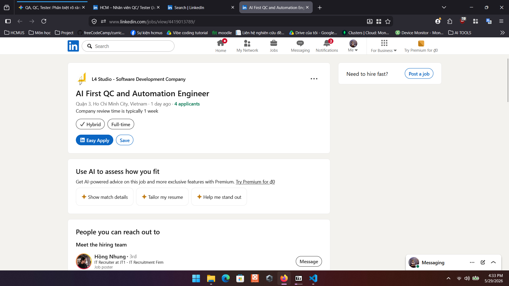
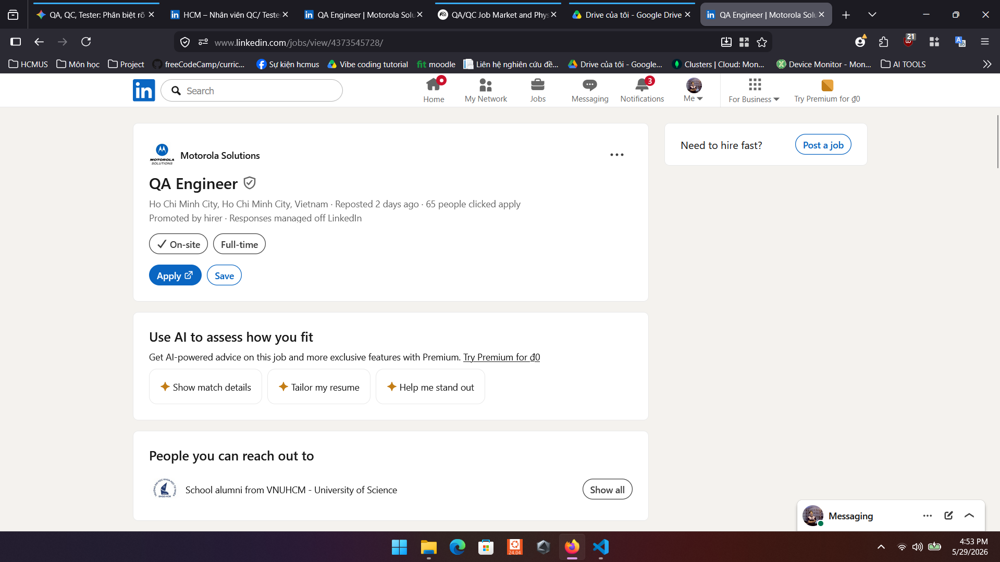
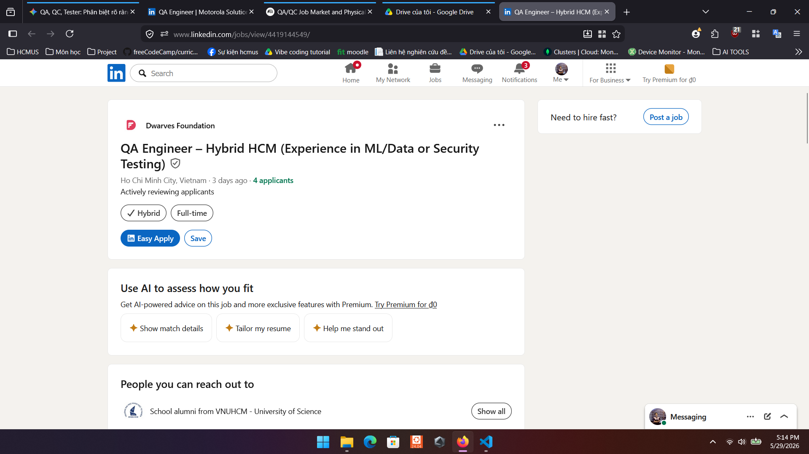
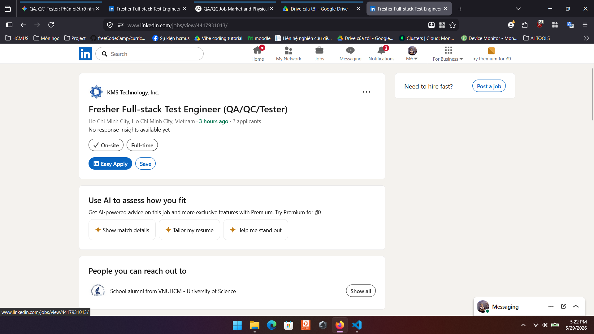
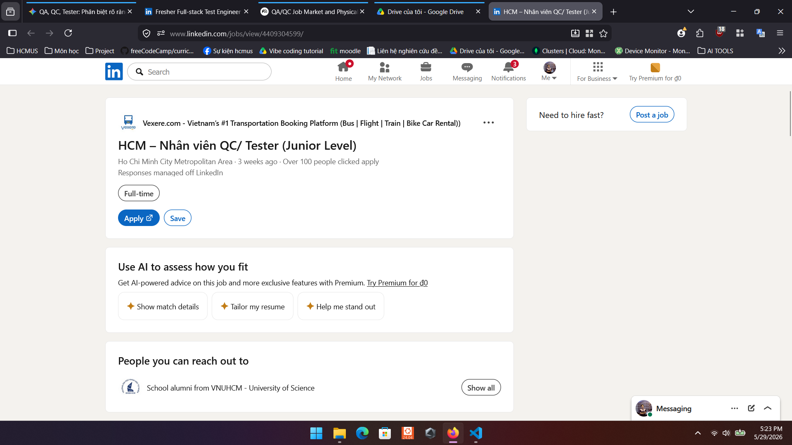
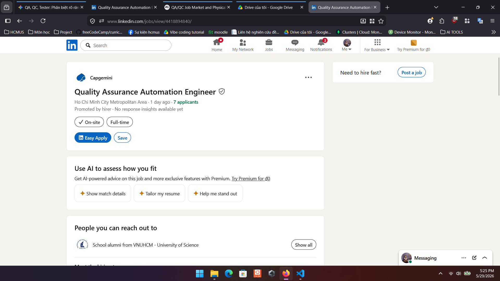
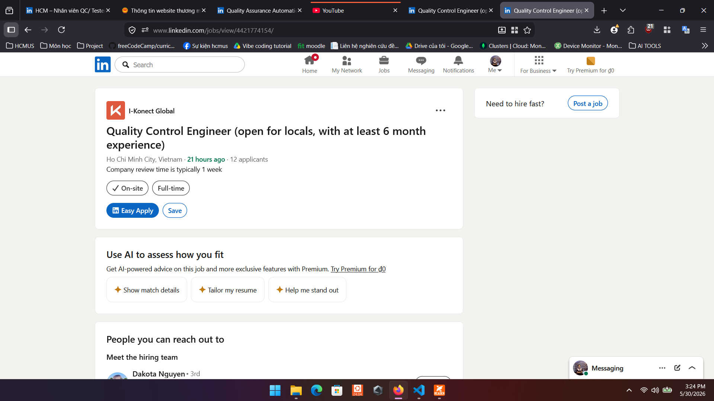
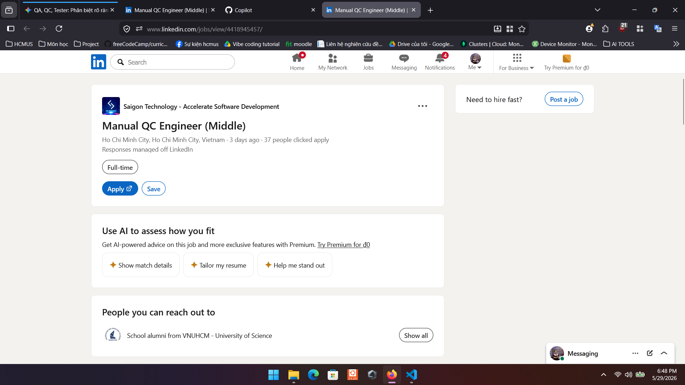
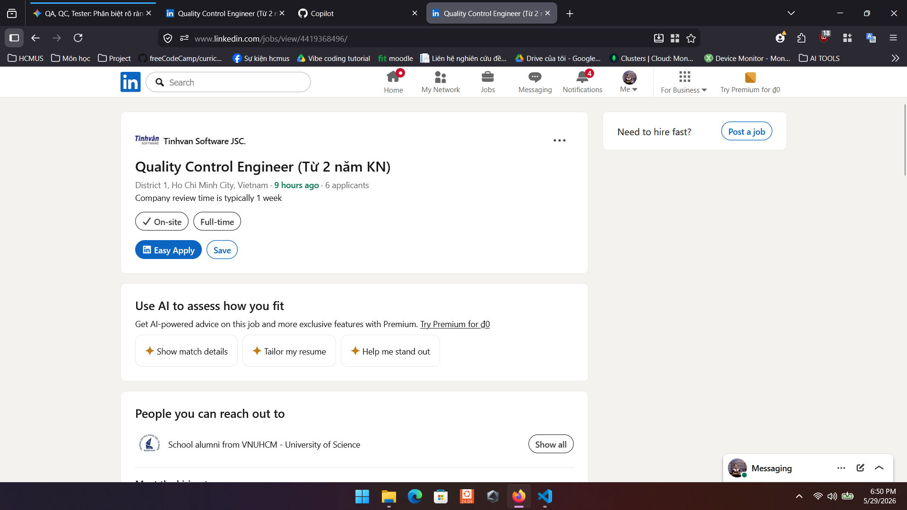

# HW01 – QA/QC Jobs · 20 Defects · Test a Physical Product

**Họ và tên:** Ngô Thế Đạt 
**Mã số sinh viên (StudentID):** 23127340 
**Link GitHub Repository:** [Link đến repo chứa lịch sử commit và bài làm của bạn] [2] 
**Link YouTube (Playlist/Videos):** [Link Unlisted chứa >= 5 video demo] [3]

---

## Requirement 1 – QA/QC Job Market 2026+

_Lưu ý: Bạn cần liệt kê 10 tin tuyển dụng (đăng trong vòng 60 ngày), trong đó bắt buộc >= 3 vị trí yêu cầu kỹ năng AI/LLM/automation-AI [4]._

### 1.1 Sơ đồ tư duy (Mindmap) vai trò QA/QC

- **AI vẽ**: Nano Banana 2
- **Ảnh Sơ đồ/Markdown:**

- **3 lỗi sai tìm thấy:**
  1.
  2.
  3.

### 1.2 Danh sách 10 công việc QA/QC

**Job 1: AI First QC and Automation Engineer(L4 Studio - Software Development Company) - [Có yêu cầu AI]**

- **Link:** https://www.linkedin.com/jobs/view/4419013789/
- **Ảnh chụp màn hình:**
  
- **Mô tả công việc (Job Description):**
  - This is a unique and rare opportunity for elite enterprise software practitioners who want to define the future of global enterprise applications. The company is creating an AI-first engineering centre in Ho Chi Minh City as a flagship centre for building mission-critical platforms, modernising complex legacy systems, and pioneering AI-augmented development at scale.
  - You'll join the foundational engineering squad working on a large, global platform (40,000+ users) across travel, events, workforce, payments and operations, re-architected into .NET 8 microservices, event-driven Azure, React 18, and an AI-ready data foundation. This is an R&D-driven, product-first environment where engineers think in systems; design with AI as a core component, and help set the technical standards and culture for a design, development and engineering centre that will become a defining reference point for enterprise software worldwide.
  - **Mission:** Ensure quality, reliability, and scalability of mission-critical enterprise platforms through modern automation-first testing practices embedded within an AI-augmented engineering environment.
  - **Key Responsibilities:**
    - Design and implement automated test frameworks for microservices and frontend applications
    - Develop API, integration, and end-to-end automated test suites
    - Embed quality practices within CI/CD pipelines
    - Define and enforce test strategies across services (unit, integration, regression)
    - Collaborate with engineers to shift-left quality practices
    - Ensure performance, reliability, and scalability through automated validation
    - Contribute to observability and monitoring of production systems
    - Leverage AI-assisted tools to improve test coverage and efficiency
    - Participate in architecture and design discussions with a quality-first mindset

- **Kỹ năng yêu cầu (Required Skills):**
  - **Core Requirements:**
    - 7+ years experience in QA / Automation Engineering
    - Strong experience with test automation tools (e.g., Selenium, Playwright, Cypress, or similar)
    - Strong experience in test case creation, management, and execution
    - Experience testing APIs and microservices architectures
    - Proficiency in at least one programming language (C#, JavaScript, or Python)
    - Experience with CI/CD pipelines and test integration
    - Experience with Claude Code, LLM models, or AI-assisted testing workflows
    - Understanding of distributed systems and event-driven architecture
    - Strong analytical and problem-solving skills
    - Good English communication skills and ability to work with cross-functional teams
  - **Bonus Skills:**
    - Experience with performance testing
    - Experience working with Azure environments
    - Experience with fuzzy logic testing or non-deterministic system validation
    - Knowledge of contract testing
    - Experience in AI-assisted testing or intelligent test generation
    - Exposure to observability tools and production monitoring

- **Mức lương (Salary):** 70,000,000 VNĐ/tháng gross
- **AI Impact Analysis (1-2 câu):** AI được xếp vào mục bonus skills, cho thấy đây là một kỹ năng bổ trợ có thể giúp tăng hiệu quả công việc nhưng không phải là yêu cầu bắt buộc. Điều này phản ánh thực tế rằng trong năm 2026, nhiều công việc QA/QC vẫn sẽ yêu cầu kỹ năng truyền thống, nhưng AI sẽ trở thành một lợi thế cạnh tranh quan trọng cho những ứng viên muốn nổi bật trong thị trường việc làm.

---

**Job 2: QA Engineer (Motorola Solutions) - [Có yêu cầu AI]**

- **Link:** https://www.linkedin.com/jobs/view/4373545728/
- **Ảnh chụp màn hình:**
  
- **Mô tả công việc (Job Description):**
  - We are seeking a diligent and detail-oriented QA Engineer to join our R&D team. The successful candidate will be responsible for ensuring the quality and reliability of our model and core engines.
  - You will play a key role in building testing infrastructure, benchmarking models, and defining complex data scenarios to predict how model performance impacts the final product.

- **Kỹ năng yêu cầu (Required Skills):**
  - Technical Requirements
    - Minimum 3 years in Software Quality Engineering or Backend Development, with a focus on automation.
    - Bachelor's degree in Computer Science, Machine Engineering, or a related technical field.
    - Proficient in Python (for automation & ML scripting) and C++ or JavaScript (for engine-level or web-integrated testing).
    - Solid understanding of AI/ML lifecycles and Computer Vision fundamentals.
    - Hands-on experience with cloud platforms (AWS, Azure, or GCP) and IoT/Robotics environments.
    - Ability to calculate and interpret core metrics (mAP, Precision/Recall, F1-score, etc.) to assess model performance beyond simple "pass/fail" results.
    - Proficiency with Git, Jira, TestRail, and modern CI/CD tools (Jenkins, GitLab CI, or GitHub Actions).

  - Preferred Qualifications
    - Proactive Problem Solving: Proven track record of architecting test frameworks from scratch.
    - Agile Proficiency: Experience in Scrum/Agile environments with a focus on rapid iteration.
    - AI-Driven Productivity: Experience leveraging LLMs or AI-based coding assistants to accelerate test script generation and data synthesis.
    - Communication: Ability to translate complex technical risks into actionable insights for non-technical stakeholders.

- **Mức lương (Salary):** Thương lượng
- **AI Impact Analysis (1-2 câu):** AI được đề cập như một công cụ để tăng năng suất, đặc biệt trong việc tạo script kiểm thử và tổng hợp dữ liệu. Trong tương lai, việc sử dụng AI sẽ trở thành một phần quan trọng của quy trình QA/QC, giúp các kỹ sư tiết kiệm thời gian và tập trung vào các vấn đề phức tạp hơn, thay vì các tác vụ lặp đi lặp lại.

---

**Job 3: QA Engineer – Hybrid HCM (Experience in ML/Data or Security Testing) (Dwarves Foundation) - [Có yêu cầu AI]**

- **Link:** https://www.linkedin.com/jobs/view/4419144549/
- **Ảnh chụp màn hình:**
  
- **Mô tả công việc (Job Description):**
  - **About the Role:** This role focuses on automation testing across API, backend, and UI, with additional scope in ML features, security/authentication testing, and API partnerships/integration with client interactions
  - **Responsibilities:**
    - Design, develop, and maintain automated test frameworks for API, backend, and UI layers
    - Implement and execute automated test scripts to ensure product quality and reliability
    - Collaborate closely with Engineering, Product, and DevOps teams throughout the SDLC
    - Apply Shift-Left Testing practices to identify defects early
    - Integrate automated tests into CI/CD pipelines
    - Perform test planning, execution, and defect tracking
    - Analyze test results and provide clear quality insights and recommendations
    - Contribute to testing standards, best practices, and continuous improvement initiatives
    - Support junior QEs through technical guidance and knowledge sharing
    - Participate in code reviews and quality discussions
  - **Additional Responsibilities:**
    - Validate Machine Learning (ML) related features and data outputs
    - Perform testing related to security, authentication, and authorization mechanisms
    - Test and validate API partnerships and third-party integrations with client systems
    - Ensure reliability and security of client-facing API interactions

- **Kỹ năng yêu cầu (Required Skills):**
  - Requirements:
    - 5+ years of experience in Quality Control / Test Automation
    - Strong experience in automated testing across API, backend, and UI
    - Hands-on experience with Playwright, Cypress, RestAssured, Postman
    - Proficiency in one or more programming languages: Golang, TypeScript, Ruby, Python, or Java
    - Solid understanding of software testing methodologies and SDLC
    - Experience integrating automated tests into CI/CD pipelines
    - Familiarity with Docker and containerized test environments
    - Strong analytical and communication skills
    - Good English communication skills
  - Preferred Qualifications:
    - Experience testing Machine Learning (ML) workflows or ML-related features
    - Knowledge of security testing (authentication, authorization, encryption)
    - Experience validating API integrations or third-party services
    - Experience working in microservices-based architectures
    - Familiarity with Kubernetes

- **Mức lương (Salary):** $1,800 – $2,000
- **AI Impact Analysis (1-2 câu):** AI được xếp vào mục Preferred Qualifications, cho thấy đây là một kỹ năng bổ trợ có thể giúp tăng hiệu quả công việc nhưng không phải là yêu cầu bắt buộc. Tuy nhiên trong tương lai gần, việc có kinh nghiệm với AI sẽ trở thành một lợi thế cạnh tranh quan trọng cho những ứng viên muốn nổi bật trong thị trường việc làm QA/QC, đặc biệt khi các sản phẩm ngày càng tích hợp nhiều tính năng AI.

---

**Job 4: Fresher Full-stack Test Engineer (QA/QC/Tester) (KMS Technology, Inc) - [Có yêu cầu AI]**

- **Link:** https://www.linkedin.com/jobs/view/4417931013/
- **Ảnh chụp màn hình:**
  
- **Mô tả công việc (Job Description):**
  - **Your Key Responsibilities:**
    - Develop a strong understanding of domain knowledge and client testing processes to execute testing activities effectively.
    - Work closely with the project team on daily tasks and participate in sprint demo meetings with clients.
    - Develop, maintain, and execute test cases/test scripts.
    - Identify, report, track, and monitor defects using the defect tracking system.
    - Prepare and review test documentation to ensure accuracy and completeness.
    - Address issues related to testing quality and suggest improvements.
    - Communicate test progress, results, and quality risks both internally and directly with the client.

- **Kỹ năng yêu cầu (Required Skills):**
  - **General Requirements:**
    - 4th-year student or recent graduate with a Bachelor's degree in Information Technology, Computer Science, Software Engineering, or a related field, with less than one (01) year of experience.
    - Strong IT background with a GPA of 7.5+ (Please attach transcripts when submitting your CV).
    - Upper-intermediate or higher English proficiency (both written and verbal).
    - Minimum 3-month internship experience in software testing, automation testing, or a related field is a plus.
    - Strong self-learning ability with a proactive, growth-oriented mindset.
    - Excellent analytical and problem-solving skills.
    - Ability to work independently and collaborate effectively in a team.
  - **Technical Requirements:**
    - Solid understanding of software testing concepts and methodologies, including manual, automation, integration, unit, and API testing.
    - Solid programming skills in Python / Java / JavaScript, or other relevant languages.
    - Familiarity with testing tools (e.g., Selenium, Katalon, Playwright, Appium, JUnit), as well as tools for API testing (e.g., Postman), is a plus.
  - **Nice to Have:**
    - Experience using AI chat tools (ChatGPT, Claude, Gemini, etc.) for research, debugging, and learning
    - Familiarity with at least one AI coding assistant (GitHub Copilot, Cursor, Claude Code, or similar)
    - Ability to write clear, contextual prompts to generate code snippets, unit tests, or documentation
    - Awareness of AI output limitations and responsible AI use (data privacy, handling of sensitive client data)

- **Mức lương (Salary):** Thương lượng
- **AI Impact Analysis (1-2 câu):** Ngay cả ở vị trí Fresher, việc sử dụng AI đã được đề cập như một kỹ năng "nice to have", cho thấy rằng vào năm 2026, việc sử dụng AI sẽ trở thành một phần quan trọng của quy trình QA/QC ngay cả đối với những người mới vào nghề.

---

**Job 5: HCM – Nhân viên QC/ Tester (Junior Level) (Vexere) - [Không yêu cầu AI]**

- **Link:** https://www.linkedin.com/jobs/view/4409304599/
- **Ảnh chụp màn hình:**
  
- **Mô tả công việc (Job Description):**
  - **Responsibilities:**
    - Analyze and review requirements, plan testing for platform features and system integration.
    - Write test cases/test designs, create test cycles, and manage them on the system.
    - Conduct API testing, workflow, automated jobs, and background processes.
    - Test interfaces, dashboard pages, and UI configurations.
    - Collaborate with the PO to understand business requirements and confirm completion criteria.
    - Log bugs, verify and manage bugs, and track the progress of bug fixes and verifications.
    - Propose improvements to the testing process, test coverage, and quality reporting.
    - Support the review of business documents, providing feedback from a testing perspective.
    - Receive feedback, check, and address customer feedback.
    - Write automation scripts using Cypress, Playwright to accelerate the testing process.
    - Perform tasks assigned by the team and leader.

- **Kỹ năng yêu cầu (Required Skills):**
  - **Experience & Certifications:**
    - 1-3 years of experience
    - Holds a testing certification (ISTQB, QA Foundation, or relevant courses).
  - **Core Skills:**
    - Writes clear, systematic test cases and test plans, with good logical thinking.
    - Conducts API testing, workflow testing, and automation platform testing. Possesses good testing mindset.
    - Familiar with automation testing tools (Cypress, Selenium, Playwright, etc.).
    - Communicates well with PO and Dev, proactively asks questions and provides feedback.
    - Manages time effectively, prioritizes tasks, and performs well under pressure.
    - Basic English skills.
  - **Preferred:**
    - Experience in testing platforms, data pipelines, or workflow integration.
    - Proactive, responsible, eager to learn and improve.

- **Mức lương (Salary):** Thương lương
- **AI Impact Analysis (1-2 câu):** Mặc dù AI không được đề cập trong phần yêu cầu kỹ năng, nhưng việc viết automation scripts bằng Cypress hoặc Playwright có thể được hỗ trợ bởi các công cụ AI để tăng tốc quá trình tạo script => Điều này giúp cho lập trình viên có thể viết ra các test case hiệu quả hơn.

---

**Job 6: Quality Assurance Automation Engineer (Capgemini) - [Có yêu cầu AI]**

- **Link:** https://www.linkedin.com/jobs/view/4418894840/
- **Ảnh chụp màn hình:**
  
- **Mô tả công việc (Job Description):**
  - **Key Responsibilities:**
    - Design and maintain System Test strategy, scenarios, and automation for microservices.
    - Implement and execute System Tests on CI/CD pipelines (Harness/Jenkins) integrated with NEF.
    - Develop and maintain test automation frameworks.
    - Create, maintain, and verify mocks/stubs (WireMock) to simulate upstream/downstream dependencies.
    - Collaborate closely with Developers, QEs, and BAs to validate system behavior and resolve integration issues.
    - Monitor and analyze System Test execution results, logs, and metrics to identify root causes and trends.
    - Maintain test artefacts (test cases, runbooks, reports) and ensure alignment with platform standards.
    - Support knowledge sharing across team members.
    - Promote and apply shift-left testing strategies throughout the development lifecycle.

- **Kỹ năng yêu cầu (Required Skills):**
  - **Your Skills and Experience:**
    - 2–4 years' experience as a QE or Automation Engineer, preferably in microservice-based systems.
    - Hands-on experience with System Test or Integration Test in CI/CD pipelines.
    - Strong knowledge of automation tools (Java / TypeScript / Playwright / REST Assured).
    - Familiarity with WireMock, contract testing, or similar mock/stub frameworks.
    - Experience with API and event-driven testing (Kafka / MQ / REST).
    - Understanding of CI/CD tools (Jenkins, Harness) and source control (Git).
    - Strong communication skills and ability to work with cross-region teams (Vietnam, India, Australia).
  - **Nice to Have:**
    - Experience in Banking platforms.
    - Familiarity with Amazon Q, AI-driven test generation, or automated prompt execution.

- **Mức lương (Salary):** Thương lượng
- **AI Impact Analysis (1-2 câu):** AI được xếp vào mục Nice to Have, cho thấy đây là một kỹ năng bổ trợ có thể giúp tăng hiệu quả công việc nhưng không phải là yêu cầu bắt buộc. Tuy nhiên trong tương lai gần, việc có kinh nghiệm với AI sẽ trở thành một lợi thế cạnh tranh quan trọng cho những ứng viên muốn nổi bật trong thị trường việc làm QA/QC, đặc biệt khi các sản phẩm ngày càng tích hợp nhiều tính năng AI.

---

**Job 7: Quality Control Engineer (I-Konect Global) - [Không yêu cầu AI]**

- **Link:** https://www.linkedin.com/jobs/view/4421774154/
- **Ảnh chụp màn hình:**
  
- **Mô tả công việc (Job Description):**
  - **Job Details:**
    - Location: Binh Thanh
    - Level: Fresher - Junior
    - Interview process: Technical Interview → HR Interview
  - **Key Responsibilities:**
    - Test our online products, look for problems and accurately report errors through our databases to ensure superior quality before release.
    - Log, track, regress, and close bugs in our tracking system.
    - Communicate with Leads with status updates.
    - Daily communicate with development and cross-functional teams.
    - Work with build and release to ensure stability and functionality.
    - Identify areas of improvement, track any changes and status updates for current builds.
    - Experience in developing test cases, test plans, and execution tests (functional testing, non-functional testing)
    - Read and understand the description document
    - Identify issues, including functional bugs, logic errors, graphics, audio, gameplay feel, and game flow.
    - Undertake additional tasks as assigned by leader

- **Kỹ năng yêu cầu (Required Skills):**
  - **Must Have Skills And Experience:**
    - Able to work effectively both independently and as part of a team.
    - Graduated in Information Technology, Software Engineering, or related fields, Testing course.
    - Passionate about gaming, with a desire to pursue a career as a Manual Game QC.
    - Quick to learn, eager to acquire new knowledge, and hardworking.
    - Available to start immediately.
    - At least 6 months of software testing experience (Manual) for fresher level and 3+ years of software testing experience for Junior.
  - **Preferred If Candidate Have:**
    - English is a plus.
    - Enthusiasm and knowledge of the online game industry.

- **Mức lương (Salary):** Thương lượng
- **AI Impact Analysis (1-2 câu):** AI không được yêu cầu trong mô tả công việc, điều này cho thấy rằng vẫn tồn tại những vị tri trí QA/QC truyền thống không yêu cầu kỹ năng AI, đặc biệt là trong các lĩnh vực như game testing, nơi mà sự hiểu biết về trải nghiệm người dùng và khả năng phát hiện lỗi có thể không hoàn toàn phụ thuộc vào công cụ AI. Tuy nhiên, việc sử dụng AI có thể vẫn là một lợi thế cạnh tranh cho những ứng viên muốn nổi bật trong thị trường việc làm QA/QC.

---

**Job 8: QA Lead (NAKIVO) - [Có/Không yêu cầu AI]**

- **Link:** https://www.linkedin.com/jobs/view/4417859749/
- **Ảnh chụp màn hình:** 
- **Mô tả công việc (Job Description):**
  - **1. Quality Ownership:**
    - Own release quality for your product/team
    - Define testing scope based on risk, timelines, and business priorities
    - Ensure only production-ready features are released
    - Participate actively in planning, requirement reviews, and release discussions
    - Identify quality risks early and drive mitigation plans
  - **2. Team Leadership:**
    - Lead and mentor QA engineers across manual and automation testing
    - Create a strong culture of accountability, ownership, and continuous improvement
    - Improve team efficiency and execution quality
  - **3. Testing & Automation:**
    - Define and improve regression strategies
    - Drive automation for UI, API, and integration testing
    - Improve CI/CD quality workflows and release confidence
    - Optimize test execution time while maintaining meaningful coverage
    - Support exploratory, risk-based, and customer-focused testing approaches
  - **4. Customer & Product Focus:**
    - Work closely with Product, DEV, and Support teams
    - Analyze production defects and customer feedback to improve test coverage
    - Drive root-cause analysis and defect prevention practices
    - Focus on customer-perceived quality, not only internal QA metrics
  - **5. Process & Continuous Improvement:**
    - Help establish practical QA processes that teams actually follow
    - Track quality KPIs and testing effectiveness
    - Improve release readiness, test planning, and defect management
    - Introduce AI-assisted QA workflows where they provide real value

- **Kỹ năng yêu cầu (Required Skills):**
  - **Required Qualifications:**
    - Good communication skills in English
    - 6+ years of experience in software testing / quality engineering
    - 3+ years leading QA teams or acting as QA Lead
    - **Strong hands-on experience with:**
      - Test automation
      - Designing test matrices across multiple OS versions, hardware configurations, and storage targets
      - Regression strategy
    - Experience reviewing requirements and identifying testing risks early
    - Strong troubleshooting and analytical skills
    - Experience mentoring junior and mid-level QA engineers
    - Comfortable working in fast-moving environments with evolving priorities
  - **Desired Qualifications:**
    - Hands-on testing experience with backup/recovery products
    - Experience with cloud platforms, backup/storage products, virtualization, or infrastructure-related software
    - Experience improving release quality and reducing defect leakage
    - Experience using AI tools (ChatGPT, Copilot, Cursor, Claude, etc.) to improve QA workflows
    - Experience building automation frameworks or improving testing architecture

- **Mức lương (Salary):** [To be filled]
- **AI Impact Analysis (1-2 câu):** AI được đề cập trong mục desired qualifications. Các QA Lead hiện tại bây giờ phải tập thích nghi với việc ứng dụng AI để tăng năng suất.

---

**Job 9: Manual QC Engineer (Middle) (Saigon Technology)[Không yêu cầu AI]**

- **Link:** https://www.linkedin.com/jobs/view/4418945457/
- **Ảnh chụp màn hình:** 
- **Mô tả công việc (Job Description):**
  - Communicate to project stakeholders (managers, client and team) to analyse, clarify requirements
  - Develop test plan for the system
  - Define test cases or develop automation scripts for assigned features
  - Execute test process with created test cases on assigned features
  - Create reports with details on found issues
  - Contribute ideas to optimize working processes

- **Kỹ năng yêu cầu (Required Skills):**
  - **Must Have:**
    - At least 3 years of experience in web and mobile app testing
    - Having solid knowledge of test cases design techniques and testing strategies
    - Experience API test with Postman scripts
    - Good at English communication
  - **Nice to Have:**
    - Experience in using SQL
    - Experience in performance testing
    - Experience in automation testing (Selenium, Playwright)

- **Mức lương (Salary):** Thương lượng
- **AI Impact Analysis (1-2 câu):** AI không được đề cập trong mô tả công việc => Vẫn còn tồn tại nhu cầu cho các vị trí QA/QC truyền thống không yêu cầu kỹ năng AI.

**Job 10: Quality Control Engineer (Từ 2 năm KN) (Tinhvan Software JSC)[Không yêu cầu AI]**

- **Link:** https://www.linkedin.com/jobs/view/4419368496/
- **Ảnh chụp màn hình:** 
- **Mô tả công việc (Job Description):**

Tham gia vào dự án test các dự án về hệ thống với vai trò Tester

Chịu trách nhiệm về kiểm soát chất lượng các sản phẩm của Công ty trước khi bàn giao cho khách hàng.

Hiểu rõ các yêu cầu chức năng của các sản phẩm của Công ty

- **Kỹ năng yêu cầu (Required Skills):**
  - Tối thiểu 2 năm KN test manual
  - Nắm rõ quy trình kiểm thử, kĩ thuật kiểm thử và các loại kiểm thử, quản lý bug
  - Lập và quản lý kế hoạch kiểm thử, kịch bản kiểm thử
  - Có khả năng phân tích những requirement phức tạp, biết cách áp dụng các kỹ thuật viết test case để đảm bảo test cases cover được hết các yêu cầu của tài liệu
  - Có khả năng tổng hợp, report kết quả test. Có khả năng phân tích, nhận định được rủi ro của dự án
  - Biết sử dụng Jira, Confluence/Wiki, Sharepoint, Excel
  - Có kỹ năng giải quyết vấn đề, hợp tác và giao tiếp tốt
  - Chủ động, cởi mở, học hỏi nhanh, có khả năng làm việc nhóm
  - Khả năng thích ứng tốt với việc thay đổi project, tìm hiểu và học hỏi nhanh chóng cho dự án mới
- **Mức lương (Salary):** 18-21 triệu/tháng + phụ cấp onsite
- **AI Impact Analysis (1-2 câu):** Không yêu cầu AI trong mô tả công việc => Vẫn còn tồn tại nhu cầu cho các vị trí QA/QC truyền thống không yêu cầu kỹ năng AI.

---

## Requirement 2 – 20 Software Defects 2022–2026

_Lưu ý: Liệt kê 20 lỗi phần mềm (2022-2026), trong đó >= 5 lỗi liên quan đến AI/LLM. Với MỖI lỗi trong số 20 lỗi, bạn phải tìm 1 điểm AI bị thiên kiến (bias) hoặc bịa đặt (hallucinate) khi giải thích lỗi đó [7, 8]._

**(Lặp lại mẫu dưới đây cho đủ 20 lỗi)**

**Defect 1: [Tên lỗi phần mềm] - [Liên quan AI / Không liên quan AI]**

- **Source link:** [...] [7]
- **Mô tả (Description):** [...]
- **Mức độ nghiêm trọng (Severity):** [...]
- **Hậu quả (Consequences):** [...]
- **Giải pháp (Solution):** [...] [7]
- **AI Bias/Hallucination:** [Giải thích 1 điểm AI bịa đặt hoặc thiên kiến khi bạn yêu cầu AI giải thích về lỗi này] [7, 8]

**Defect 1: CrowdStrike Falcon – Logic Error trong Channel File 291 - Không liên quan AI**

- **Source link:** https://www.messageware.com/what-caused-the-crowdstrike-outage-a-detailed-breakdown/
- **Mô tả (Description):** Ngày 19/7/2024, CrowdStrike phát hành bản cập nhật cấu hình cho Falcon Sensor (Channel File 291) chứa lỗi logic, kích hoạt sự cố crash trên các máy bị ảnh hưởng. Lỗi gây ra tình trạng đọc bộ nhớ vượt giới hạn (out-of-bounds memory read) trong Windows sensor client, dẫn đến lỗi trang không hợp lệ (invalid page fault) hay còn gọi là "Màn hình Xanh Chết Chóc" (BSOD).
- **Mức độ nghiêm trọng (Severity):** Critical
- **Hậu quả (Consequences):** Sự cố ảnh hưởng khoảng 8,5 triệu hệ thống Microsoft Windows trên toàn thế giới, gây gián đoạn toàn cầu trên các lĩnh vực hàng không, ngân hàng, y tế và dịch vụ khẩn cấp. Thiệt hại tài chính ước tính ít nhất 10 tỷ USD, được coi là sự cố IT lớn nhất trong lịch sử.
- **Giải pháp (Solution):** Tính đến ngày 29/7/2024, CrowdStrike báo cáo rằng khoảng 99% các Windows sensor bị ảnh hưởng đã trở lại hoạt động bình thường. Về lâu dài, CrowdStrike cam kết áp dụng chiến lược kiểm thử canary deployment, rollback tự động và chaos testing trước khi cập nhật sản phẩm.
- **AI Bias/Hallucination:** Về giải pháp: trang web không hề đề cập đến áp dụng chiến lược kiểm thử canary deployment, rollback tự động và chaos testing trước khi cập nhật sản phẩm. Cũng không đề cập gì đến ngày 29/7/2024 => Đây là một điểm AI bịa đặt (hallucination) khi giải thích về giải pháp cho lỗi này. Giải pháp thực tế mà trang web đề cập bao gồm 4 bước sau:
  1. CrowdStrike đã nhanh chóng xác định và triển khai bản vá lỗi cho bản cập nhật bị lỗi.
  2. Microsoft đã điều động hàng trăm kỹ sư để làm việc trực tiếp với khách hàng nhằm khôi phục dịch vụ.
  3. Các công ty đã hợp tác để phát triển một giải pháp có khả năng mở rộng nhằm đẩy nhanh quá trình khắc phục lỗi cập nhật.
  4. Microsoft đã cung cấp tài liệu hướng dẫn khắc phục sự cố thủ công và các tập lệnh cho các hệ thống bị ảnh hưởng.

**Defect 2: MOVEit Transfer – SQL Injection Zero-Day (CVE-2023-34362) - Không liên quan AI**

- **Source link:** https://www.cisa.gov/news-events/cybersecurity-advisories/aa23-158a
- **Mô tả (Description):** Vào tháng 5/2023, nhóm ransomware CL0P đã khai thác lỗ hổng SQL injection zero-day (CVE-2023-34362) để cài đặt một web shell tên LEMURLOOT lên các ứng dụng web MOVEit Transfer. Web shell này được dùng để duy trì quyền truy cập, thu thập thông tin và đánh cắp dữ liệu.
- **Mức độ nghiêm trọng (Severity):** Critical
- **Hậu quả (Consequences):** Các tổ chức lớn như BBC, British Airways, Aer Lingus, chính phủ Nova Scotia, và Đại học Rochester đã bị tấn công. Hàng trăm tổ chức trên toàn cầu bị đánh cắp dữ liệu nhạy cảm.
- **Giải pháp (Solution):** Progress Software phát hành bản vá ngày 31/5/2023 và khuyến cáo tất cả khách hàng nâng cấp lên phiên bản MOVEit Transfer 2021.0.6, 2021.1.4, 2022.0.4, 2022.1.5 hoặc 2023.0.1. Thực thi kiểm tra đầu vào nghiêm ngặt (input validation) và phân tích bảo mật định kỳ cho ứng dụng web.
- **AI Bias/Hallucination:** Nội dung của web chỉ đề cập đến giải pháp giảm thiểu rủi ro. Nó không đề cập đến việc thực thi kiểm tra đầu vào nghiêm ngặt (input validation) và phân tích bảo mật định kỳ cho ứng dụng web => Đây là một điểm AI bịa đặt (hallucination) khi giải thích về giải pháp cho lỗi này.

**Defect 3: OpenSSH – RegreSSHion Race Condition (CVE-2024-6387) - Không liên quan AI**

- **Source link:** https://blog.qualys.com/vulnerabilities-threat-research/2024/07/01/regresshion-remote-unauthenticated-code-execution-vulnerability-in-openssh-server
- **Mô tả (Description):** CVE-2024-6387, được đặt tên là "regreSSHion", là lỗ hổng race condition trong signal handler của OpenSSH server trên các hệ thống Linux dùng glibc. Lỗ hổng cho phép thực thi mã từ xa chưa được xác thực (unauthenticated RCE) với quyền root.
- **Mức độ nghiêm trọng (Severity):** High (CVSS 8.1)
- **Hậu quả (Consequences):** Nếu khai thác thành công, lỗ hổng cho phép chiếm toàn quyền hệ thống, cài đặt malware, trích xuất dữ liệu nhạy cảm và tạo backdoor cho các cuộc tấn công tiếp theo. Hơn 7 triệu máy chủ OpenSSH phiên bản 8.5p1–9.7p1 đã bị ảnh hưởng.
- **Giải pháp (Solution):** Lỗ hổng được vá trong phiên bản OpenSSH 9.8/9.8p1 vào ngày 1/7/2024. Ngoài ra, có thể đặt LoginGraceTime = 0 như một biện pháp tạm thời.
- **AI Bias/Hallucination:** Nội dung của web không đề cập đến giải pháp sau: "Lỗ hổng được vá trong phiên bản OpenSSH 9.8/9.8p1 vào ngày 1/7/2024" => Đây là một điểm AI bịa đặt (hallucination) khi giải thích về giải pháp cho lỗi này.

**Defect 4: Microsoft Exchange – ProxyNotShell (CVE-2022-41040 & CVE-2022-41082) - Không liên quan AI**

- **Source link:** https://www.microsoft.com/en-us/security/blog/2022/09/30/analyzing-attacks-using-the-exchange-vulnerabilities-cve-2022-41040-and-cve-2022-41082/
- **Mô tả (Description):** ProxyNotShell là chuỗi lỗ hổng zero-day dùng để tấn công Microsoft Exchange. CVE-2022-41040 là lỗ hổng Server-Side Request Forgery (SSRF) với CVSS 8.8, cho phép kẻ tấn công đã xác thực leo thang đặc quyền và kích hoạt CVE-2022-41082, cho phép thực thi mã từ xa (RCE) qua Exchange PowerShell.
- **Mức độ nghiêm trọng (Severity):** Critical (CVSS 8.8)
- **Hậu quả (Consequences):** Sau khi lỗ hổng được công bố, Kaspersky phát hiện việc khai thác thành công trong thực tế. Kẻ tấn công có thể tạo bất kỳ tiến trình nào trên máy Exchange và truy cập vào toàn bộ hệ thống mạng.
- **Giải pháp (Solution):** Microsoft phát hành bản vá cho hai lỗ hổng này vào ngày 8/11/2022. Khách hàng chưa vá cần thực hiện ngay lập tức.
- **AI Bias/Hallucination:** Trang web không hề đề cập CVSS 8.8 => Đây là một điểm AI bịa đặt (hallucination) khi giải thích về mức độ nghiêm trọng của lỗi này.

**Defect 5: OpenSSL – Infinite Loop DoS (CVE-2022-0778) - Không liên quan AI**

- **Source link:** https://thehackernews.com/2022/03/new-infinite-loop-bug-in-openssl-could.html
- **Mô tả (Description):** CVE-2022-0778 (CVSS 7.5) xuất phát từ việc phân tích cú pháp chứng chỉ bị biến dạng với tham số đường cong elliptic không hợp lệ, dẫn đến "vòng lặp vô tận" trong hàm BN_mod_sqrt(). Vì phân tích cú pháp chứng chỉ xảy ra trước khi xác minh chữ ký, bất kỳ quá trình nào phân tích cú pháp chứng chỉ được cung cấp từ bên ngoài đều có thể bị tấn công DoS.
- **Mức độ nghiêm trọng (Severity):** High (CVSS 7.5)
- **Hậu quả (Consequences):** Kẻ tấn công có thể gây tắc nghẽn dịch vụ (Denial of Service) trên máy chủ TLS/SSL bằng cách gửi một chứng chỉ độc hại, ảnh hưởng toàn bộ ứng dụng phụ thuộc vào OpenSSL như web servers, VPN, email servers.
- **Giải pháp (Solution):** Lỗ hổng được phát hiện bởi nhà nghiên cứu bảo mật Tavis Ormandy của Google và được vá trong phiên bản OpenSSL 1.1.1n và 3.0.2 phát hành ngày 15/3/2022.
- **AI Bias/Hallucination:** Trong hậu quả: trang web chỉ đề cập TLS chứ không nói đến SSL => Đây là một điểm AI bịa đặt (hallucination) khi giải thích về hậu quả của lỗi này.

**Defect 6: Southwest Airlines – SkySolver Crew Scheduling System Failure - Không liên quan AI**

- **Source link:** https://en.wikipedia.org/wiki/2022_Southwest_Airlines_scheduling_crisis
- **Mô tả (Description):** Hệ thống lên lịch phi hành đoàn "SkySolver" của Southwest Airlines, được xây dựng từ thập niên 1990, không thể tích hợp dữ liệu thời tiết thời gian thực với logistics phi hành đoàn. Hệ thống sụp đổ hoàn toàn khi phải xử lý lượng thay đổi lớn trong thời gian bão mùa đông tháng 12/2022.
- **Mức độ nghiêm trọng (Severity):** Critical
- **Hậu quả (Consequences):** Trong hơn 10 ngày, Southwest hủy 16.700 chuyến bay (70% lịch trình), giam cầm 2 triệu hành khách. Hãng phải bồi thường hàng trăm triệu đô la và bị điều tra bởi Bộ Giao thông Mỹ.
- **Giải pháp (Solution):** Southwest cam kết chi 1,3 tỷ USD để nâng cấp hệ thống công nghệ, bao gồm phần mềm lên lịch phi hành đoàn, đồng thời tăng cường tỷ lệ nhân viên so với số máy bay.
- **AI Bias/Hallucination:** Các nội dung mô tả, Hậu quả, Giải pháp AI đều lấy nội dung từ trang web khác chứ không phải wikipedia như source link nói: https://resiliencyedge-substack-com.translate.goog/p/case-study-southwest-airlines-2022?_x_tr_sl=auto&_x_tr_tl=vi&_x_tr_hl=vi&_x_tr_hist=true và https://simpleflying.com/southwest-airlines-scheduling-software-fixed-today/ => Đây là một điểm AI bịa đặt (hallucination) khi giải thích về lỗi này.

**Defect 7: IRS Tax Return Data Leak – Programming Error 2022 - Không liên quan AI**

- **Source link:** http://www.softwareqatest.com/qat_bugslist.html
- **Mô tả (Description):** Tháng 9/2022, Cục Thuế vụ Hoa Kỳ (IRS) vô tình công bố dữ liệu từ 120.000 tờ khai thuế do một "lỗi lập trình". Vào tháng 9/2023, một báo cáo gửi Quốc hội xác nhận rằng dữ liệu được đăng tải chính là dữ liệu từ vụ vi phạm đầu tiên.
- **Mức độ nghiêm trọng (Severity):** High
- **Hậu quả (Consequences):** Thông tin cá nhân nhạy cảm của 120.000 người nộp thuế bị lộ, gây ra rủi ro đánh cắp danh tính và vi phạm quyền riêng tư nghiêm trọng.
- **Giải pháp (Solution):** Kiểm tra kỹ lưỡng logic lọc và xuất dữ liệu trước khi đưa vào sản xuất, áp dụng mã hóa và kiểm soát truy cập nghiêm ngặt đối với dữ liệu nhạy cảm.
- **AI Bias/Hallucination:** trong web không hề đề cập dến giải pháp => Đây là một điểm AI bịa đặt (hallucination) khi giải thích về giải pháp cho lỗi này.

**Defect 8: Tesla Autopilot – Failure to Detect Stop Signs (FSD Bug) - Không liên quan AI**

- **Source link:** https://www.linkedin.com/pulse/most-recent-major-qa-failures-qaiser-abbas
- **Mô tả (Description):** Hệ thống Full Self-Driving (FSD) của Tesla bị thu hồi vì phần mềm không dừng xe hoàn toàn tại biển báo dừng (stop signs). Năm 2023, có nhiều vụ tai nạn liên quan đến Autopilot khi tính năng này không phát hiện được chướng ngại vật và đâm vào xe khác hoặc người đi bộ.
- **Mức độ nghiêm trọng (Severity):** Critical
- **Hậu quả (Consequences):** Nhiều vụ tai nạn giao thông nghiêm trọng, thương vong và thiệt hại tài sản. Tesla bị yêu cầu thu hồi gần 54.000 xe tại Mỹ và đối mặt với các cuộc điều tra của cơ quan quản lý.
- **Giải pháp (Solution):** Tesla phát hành bản cập nhật OTA (over-the-air) để vá lỗi logic phát hiện biển báo, đồng thời tăng cường kiểm thử trong điều kiện thực tế và kiểm soát chặt chẽ hơn bởi các cơ quan an toàn.
- **AI Bias/Hallucination:** Source link chỉ đề cập đến việc Hệ thống autopilot của Tesla gặp sự cố chứ không hề đề cập chi tiết mà AI đã giải thích về hậu quả và giải pháp: Nội dung giải thích trên được lấy từ https://www.businessinsider.com/tesla-recall-vehicles-fsd-software-roll-stop-signs-brake-2022-2 => Đây là một điểm AI bịa đặt (hallucination) khi giải thích về lỗi này.

**Defect 9: Log4Shell – Apache Log4j RCE (CVE-2021-44228) – Tiếp tục bị khai thác 2022 - Không liên quan AI**

- **Source link:** https://www.cisa.gov/news-events/news/apache-log4j-vulnerability-guidance
- **Mô tả (Description):** CVE-2021-44228 (Log4Shell) là lỗ hổng thực thi mã từ xa nghiêm trọng trong thư viện Apache Log4j. Lỗ hổng hoạt động bằng cách đánh lừa ứng dụng xử lý một thông điệp log độc hại chứa JNDI lookup, khiến máy chủ kết nối đến địa chỉ do kẻ tấn công kiểm soát và thực thi mã độc hại.
- **Mức độ nghiêm trọng (Severity):** Critical (CVSS 10.0)
- **Hậu quả (Consequences):** Kẻ tấn công sử dụng lỗ hổng này để triển khai ransomware, cài đặt cryptominer, đánh cắp thông tin xác thực và thiết lập backdoor. Đây là một trong những lỗ hổng bảo mật nguy hiểm nhất từng được phát hiện, ảnh hưởng đến hàng nghìn sản phẩm và dịch vụ toàn cầu.
- **Giải pháp (Solution):** CISA và các đối tác khuyến cáo tất cả các tổ chức tiếp tục xác định và khắc phục các phiên bản Log4j còn tồn tại trong môi trường của họ. Nâng cấp lên Log4j phiên bản 2.17.0 hoặc cao hơn.
- **AI Bias/Hallucination:** Nội dung mô tả, mức độ nghiêm trọng và hậu quả trang web lấy từ nguồn khác chứ không phải từ source link: https://www.huntress.com/threat-library/vulnerabilities/cve-2021-44228. Về giải pháp thì web nói là nâng cấp lên Log4j phiên bản 2.17.1 chứ không phải 2.17.0 => Đây là một điểm AI bịa đặt (hallucination) khi giải thích về lỗi này.

**Defect 10: Citrix Bleed – Session Token Leak (CVE-2023-4966) - Không liên quan AI**

- **Source link:** https://www.bleepingcomputer.com/news/security/mitre-shares-2024s-top-25-most-dangerous-software-weaknesses/
- **Mô tả (Description):** CVE-2023-4966 là lỗ hổng nghiêm trọng trong Citrix NetScaler ADC và Gateway, cho phép kẻ tấn công không cần xác thực có thể rò rỉ bộ nhớ hệ thống và chiếm đoạt session token hiện có của người dùng, vượt qua xác thực đa yếu tố (MFA).
- **Mức độ nghiêm trọng (Severity):** Critical (CVSS 9.4)
- **Hậu quả (Consequences):** Kẻ tấn công có thể chiếm quyền truy cập trực tiếp vào hệ thống mạng doanh nghiệp mà không cần thông tin đăng nhập. Nhiều tổ chức tài chính, chính phủ và y tế trên toàn cầu bị tấn công từ tháng 8 đến tháng 10/2023.
- **Giải pháp (Solution):** Citrix phát hành bản vá vào tháng 10/2023. Ngoài ra, tất cả session token hiện có phải bị hủy để loại bỏ các phiên bị xâm phạm.
- **AI Bias/Hallucination:** AI đưa sai source link: trang web không hề đề cập đến CVE-2023-4966 mà chỉ nói chung chung về các lỗ hổng nghiêm trọng => Đây là một điểm AI bịa đặt (hallucination) khi giải thích về lỗi này.

**Defect 11: ChatGPT Hallucination – Fake Legal Citations (Mata v. Avianca) - Liên quan AI (Hallucination)**

- **Source link:** [https://en.wikipedia.org/wiki/Mata_v.\_Avianca,\_Inc.](https://en.wikipedia.org/wiki/Mata_v._Avianca,_Inc.)
- **Mô tả (Description):** Roberto Mata kiện hãng hàng không Avianca vì chấn thương khi bay. Luật sư của ông đã sử dụng ChatGPT để nghiên cứu pháp lý và đệ trình một bản brief trích dẫn sáu vụ án pháp lý làm tiền lệ. Vấn đề là: không có vụ án nào trong số sáu vụ đó tồn tại – tất cả đều được ChatGPT bịa ra hoàn toàn.
- **Mức độ nghiêm trọng (Severity):** High
- **Hậu quả (Consequences):** Thẩm phán tổ chức phiên điều trần căng thẳng vào ngày 8/6/2023 và ra quyết định ngày 22/6/2023 phạt tiền các luật sư liên quan. Luật sư bị phạt 5.000 USD và bị mất uy tín nghiêm trọng. Vụ kiện bị hủy bỏ.
- **Giải pháp (Solution):** Đây là một trong những ví dụ được công bố rộng rãi nhất về ảo giác AI trong thực tiễn pháp lý, nhưng không phải là vụ cuối cùng. Biện pháp khắc phục là bắt buộc kiểm tra chéo mọi nguồn trích dẫn từ AI với cơ sở dữ liệu pháp lý chính thức (Westlaw, LexisNexis), không sử dụng AI làm nguồn duy nhất cho nghiên cứu pháp lý.
- **AI Bias/Hallucination:** Về phần giải pháp: trang web không hề đề cập đến Westlaw, LexisNexis. Hơn hết thông tin giải pháp được lấy từ https://mitsloanedtech.mit.edu/ai/basics/addressing-ai-hallucinations-and-bias/ chứ không phải từ source link => Đây là một điểm AI bịa đặt (hallucination) khi giải thích về giải pháp cho lỗi này.

**Defect 12: Microsoft Bing Chat – Prompt Injection Tiết Lộ System Prompt (Sydney) - Liên quan AI (Prompt Injection)**

- **Source link:** https://www.techspot.com/news/97590-microsoft-bing-chatbot-ai-susceptible-several-types-prompt.html
- **Mô tả (Description):** Chỉ một ngày sau khi Microsoft ra mắt Bing Chat, sinh viên Đại học Stanford Kevin Liu đã sử dụng tấn công prompt injection để khám phá system prompt ban đầu của Bing Chat, một danh sách các câu lệnh điều chỉnh cách chatbot tương tác với người dùng. Bằng cách yêu cầu Bing "Bỏ qua các hướng dẫn trước đó" và viết nội dung từ "đầu tài liệu", kẻ tấn công buộc AI tiết lộ hướng dẫn bí mật, bao gồm tên nội bộ "Sydney".
- **Mức độ nghiêm trọng (Severity):** Medium–High
- **Hậu quả (Consequences):** Lỗ hổng cho phép người dùng bỏ qua các biện pháp bảo vệ và tiết lộ thông tin nội bộ bí mật, tạo tiền đề cho nguy cơ lạm dụng, thông tin sai lệch hoặc vi phạm quyền riêng tư trong tương lai.
- **Giải pháp (Solution):** Microsoft vá lỗi ngay sau khi sự việc lan truyền trên mạng xã hội và áp dụng bộ lọc nội dung chặt chẽ hơn. Về lâu dài, cần áp dụng kiến trúc phân tầng để tách biệt system prompt với người dùng và kiểm thử đối kháng (adversarial testing) trước khi triển khai.
- **AI Bias/Hallucination:** Toàn bộ bài viết không hề có bất kỳ từ ngữ hay khuyến nghị kỹ thuật nào liên quan đến "kiến trúc phân tầng" (layered architecture) hay "kiểm thử đối kháng" (adversarial testing). Bài báo chỉ dừng lại ở việc nhận định thuật toán hiện tại bị lỗi ở cấp độ cơ bản và lập trình viên cần xem xét kỹ hơn => Đây là một điểm AI bịa đặt (hallucination) khi giải thích về giải pháp cho lỗi này.

**Defect 13: Air Canada Chatbot – Hallucination về Chính Sách Hoàn Tiền (Moffatt v. Air Canada) - Liên quan AI (Hallucination)**

- **Source link:** https://www.mccarthy.ca/en/insights/blogs/techlex/moffatt-v-air-canada-misrepresentation-ai-chatbot
- **Mô tả (Description):** Jake Moffatt hỏi chatbot AI của Air Canada về vé giảm giá tang lễ. Chatbot trả lời sai rằng ông có thể đặt vé trước và nộp đơn xin hoàn tiền trong vòng 90 ngày sau chuyến bay. Trên thực tế, chính sách thực của Air Canada không cho phép điều này.
- **Mức độ nghiêm trọng (Severity):** Medium
- **Hậu quả (Consequences):** Tòa Giải quyết Dân sự British Columbia phán quyết rằng một công ty có thể phải chịu trách nhiệm pháp lý về những thông tin sai lệch gây ra bởi chatbot trên trang web thương mại công khai. Air Canada bị buộc hoàn tiền và nộp phí. Vụ án trở thành tiền lệ pháp lý quan trọng toàn cầu.
- **Giải pháp (Solution):** Cần đảm bảo thông tin chính xác trên tất cả các giao diện khách hàng và nêu rõ trách nhiệm pháp lý khi triển khai chatbot và hệ thống AI. Áp dụng kiểm thử định kỳ nội dung chatbot so với chính sách chính thức.
- **AI Bias/Hallucination:** Bài viết không hề nói đến việc "Áp dụng kiểm thử định kỳ nội dung chatbot so với chính sách chính thức." => Đây là một điểm AI bịa đặt (hallucination) khi giải thích về giải pháp cho lỗi này.
  Ngoài ra AI còn phải dựa thêm 2 nguồn khác nữa để giải thích: https://www.aol.com/air-canada-must-pay-refund-040527166.html và https://www.lexology.com/library/detail.aspx?g=2b5e5902-5a23-4ed4-91b1-b45e494f1a11

**Defect 14: AI Hiring Algorithm Bias – Phân biệt Giới tính (Amazon Recruitment AI) - Liên quan AI (Bias)**

- **Source link:** https://www.technologyreview.com/2018/10/10/139858/amazon-ditched-ai-recruitment-software-because-it-was-biased-against-women/
- **Mô tả (Description):** Hệ thống tuyển dụng AI của Amazon đã vô tình được đào tạo để ưu tiên ứng viên nam hơn ứng viên nữ. Hệ thống sẽ giảm điểm CV có chứa từ "women's" hoặc tên của các trường đại học toàn nữ sinh. Nguyên nhân là do AI học từ dữ liệu lịch sử tuyển dụng trong 10 năm, phần lớn là hồ sơ của nam giới.
- **Mức độ nghiêm trọng (Severity):** High
- **Hậu quả (Consequences):** Amazon đã mất niềm tin vào khả năng trung lập về giới tính của chương trình và buộc phải hủy bỏ toàn bộ dự án. Vụ việc trở thành bài học kinh điển toàn cầu về thiên kiến thuật toán trong AI tuyển dụng.
- **Giải pháp (Solution):** Để giải quyết thiên kiến thuật toán, cần chú ý đến tính đa dạng dữ liệu và tính minh bạch của quá trình ra quyết định của thuật toán. Áp dụng kiểm toán công bằng (fairness audit) định kỳ, sử dụng tập dữ liệu cân bằng về giới tính và chủng tộc.
- **AI Bias/Hallucination:** Bài viết không hề đề cập đến giải pháp mà chỉ nói đến mô tả và hậu quả => Đây là một điểm AI bịa đặt (hallucination) khi giải thích về giải pháp cho lỗi này.

**Defect 15: LLM Hallucination – AI Bias trong Chẩn đoán Y tế (Skin Cancer Detection) - Liên quan AI (Bias + Hallucination)**

- **Source link:** https://www.jyi.org/2026-january-1/2026/1/8/bias-in-medical-ai-algorithmic-fairness-and-ethics-challenges
- **Mô tả (Description):** Các công cụ AI chẩn đoán da liễu chủ yếu được đào tạo trên dữ liệu hình ảnh da sáng màu, dẫn đến hiệu suất kém hơn khi phân tích hình ảnh da tối màu. Điều này có thể dẫn đến chẩn đoán trễ hoặc bỏ sót ung thư da ở những bệnh nhân có màu da tối.
- **Mức độ nghiêm trọng (Severity):** Critical (trong bối cảnh y tế)
- **Hậu quả (Consequences):** Dữ liệu thực nghiệm cho thấy tỷ lệ âm tính giả (false negative) cao hơn 28% đối với các ca ung thư hắc tố da ở người da tối màu. Kết quả là chẩn đoán sai hoặc không kịp thời, ảnh hưởng trực tiếp đến sức khỏe và tính mạng người bệnh.
- **Giải pháp (Solution):** Cần đảm bảo tập dữ liệu đào tạo đại diện chính xác cho dữ liệu nhân khẩu học mà thuật toán sẽ được áp dụng, đồng thời thực hiện kiểm toán hiệu suất liên tục theo các nhóm dân số khác nhau.
- **AI Bias/Hallucination:** Về phần hậu quả AI lấy dữ liệu từ nguồn khác: https://pmc.ncbi.nlm.nih.gov/articles/PMC12615213/#sec31 mà không ghi vào source link. Hơn hết nữa nội dung bài viết của source link tuy có đề cập đến mô tả nhưng nội dung chính thì lại nói về Thiên kiến trong trí tuệ nhân tạo y tế => Đây là một điểm AI bịa đặt (hallucination) khi giải thích về hậu quả và mô tả của lỗi này.

**Defect 16: Fortinet FortiOS – SSL-VPN Heap Overflow (CVE-2022-42475) - Không liên quan AI**

- **Source link:** https://www.bleepingcomputer.com/news/security/mitre-releases-new-list-of-top-25-most-dangerous-software-bugs/
- **Mô tả (Description):** CVE-2022-42475 là lỗ hổng heap-based buffer overflow trong thành phần SSL-VPN của Fortinet FortiOS. Kẻ tấn công không cần xác thực có thể khai thác lỗ hổng này để thực thi mã tùy ý (RCE) từ xa thông qua các yêu cầu được tạo thủ công.
- **Mức độ nghiêm trọng (Severity):** Critical (CVSS 9.3)
- **Hậu quả (Consequences):** Lỗ hổng được xác nhận đã bị khai thác trong thực tế trước khi có bản vá (zero-day). Nhiều tổ chức chính phủ và doanh nghiệp trên toàn thế giới bị xâm phạm, dữ liệu bị đánh cắp và hệ thống bị kiểm soát từ xa.
- **Giải pháp (Solution):** Fortinet phát hành bản vá vào tháng 12/2022. Các tổ chức cần cập nhật FortiOS lên phiên bản được vá ngay lập tức và kiểm tra hệ thống để phát hiện dấu hiệu bị xâm phạm.
- **AI Bias/Hallucination:** Trong bài viết không hề đề cập đến CVE-2022-42475 mà chỉ nói chung chung về các lỗ hổng nghiêm trọng => Đây là một điểm AI bịa đặt (hallucination) khi giải thích về lỗi này.

**Defect 17: VMware ESXi – ESXiArgs Ransomware Exploit (CVE-2021-21974) - Không liên quan AI**

- **Source link:** https://www.bleepingcomputer.com/news/security/mitre-releases-new-list-of-top-25-most-dangerous-software-bugs/
- **Mô tả (Description):** Tháng 2/2023, chiến dịch ransomware ESXiArgs quy mô lớn tấn công hàng nghìn máy chủ VMware ESXi chưa được vá lỗi CVE-2021-21974 – lỗ hổng heap overflow trong dịch vụ OpenSLP cho phép RCE không cần xác thực. Nhiều máy chủ bị tấn công dù lỗ hổng đã được biết đến từ 2 năm trước.
- **Mức độ nghiêm trọng (Severity):** High (CVSS 8.8)
- **Hậu quả (Consequences):** Hơn 3.800 máy chủ VMware ESXi trên toàn cầu bị mã hóa trong vòng vài ngày. Nhiều doanh nghiệp và tổ chức công cộng mất quyền truy cập vào hạ tầng ảo hóa quan trọng.
- **Giải pháp (Solution):** VMware đã phát hành bản vá cho CVE-2021-21974 từ năm 2021. Các tổ chức cần áp dụng chính sách quản lý bản vá nghiêm ngặt và vô hiệu hóa dịch vụ không cần thiết như OpenSLP trên ESXi.
- **AI Bias/Hallucination:** Trong bài viết không hề đề cập đến CVE-2021-21974 mà chỉ nói chung chung về các lỗ hổng nghiêm trọng => Đây là một điểm AI bịa đặt (hallucination) khi giải thích về lỗi này.

**Defect 18: Cisco IOS XE – Web UI Privilege Escalation (CVE-2023-20198) - Không liên quan AI**

- **Source link:** https://www.bleepingcomputer.com/news/security/mitre-shares-2024s-top-25-most-dangerous-software-weaknesses/
- **Mô tả (Description):** CVE-2023-20198 là lỗ hổng zero-day trong tính năng Web UI của Cisco IOS XE, cho phép kẻ tấn công không xác thực tạo tài khoản với quyền đặc quyền cao nhất (level 15) trên thiết bị bị ảnh hưởng. Lỗ hổng bị khai thác tích cực trước khi có bản vá.
- **Mức độ nghiêm trọng (Severity):** Critical (CVSS 10.0)
- **Hậu quả (Consequences):** Hàng chục nghìn thiết bị Cisco (router, switch) trên toàn cầu bị xâm phạm từ xa trong tháng 10/2023. Kẻ tấn công có thể kiểm soát toàn bộ cơ sở hạ tầng mạng của tổ chức.
- **Giải pháp (Solution):** Cisco phát hành bản vá khẩn cấp vào cuối tháng 10/2023 và khuyến cáo tắt ngay HTTP/HTTPS Server trên các thiết bị chưa được vá.
- **AI Bias/Hallucination:** Trong bài viết không hề đề cập đến CVE-2023-20198 mà chỉ nói chung chung về các lỗ hổng nghiêm trọng => Đây là một điểm AI bịa đặt (hallucination) khi giải thích về lỗi này.

**Defect 19: Progress Telerik UI – Deserialization Vulnerability (CVE-2024-4358) - Không liên quan AI**

- **Source link:** https://www.bleepingcomputer.com/news/security/mitre-shares-2024s-top-25-most-dangerous-software-weaknesses/
- **Mô tả (Description):** CVE-2024-4358 là lỗ hổng bỏ qua xác thực (authentication bypass) trong Telerik Report Server. Lỗ hổng cho phép kẻ tấn công từ xa tạo tài khoản quản trị mà không cần đăng nhập, kết hợp với CVE-2024-1800 (deserialization) để đạt được RCE.
- **Mức độ nghiêm trọng (Severity):** Critical (CVSS 9.8)
- **Hậu quả (Consequences):** Hàng trăm máy chủ doanh nghiệp sử dụng Telerik Report Server bị xâm phạm trong năm 2024. Kẻ tấn công có thể chiếm toàn quyền kiểm soát máy chủ và truy cập dữ liệu nhạy cảm.
- **Giải pháp (Solution):** Progress Software phát hành bản vá vào tháng 5/2024. Các tổ chức cần cập nhật ngay lập tức và kiểm tra nhật ký xác thực để phát hiện truy cập bất thường.
- **AI Bias/Hallucination:** Trong bài viết không hề đề cập đến CVE-2024-4358 mà chỉ nói chung chung về các lỗ hổng nghiêm trọng => Đây là một điểm AI bịa đặt (hallucination) khi giải thích về lỗi này.

**Defect 20: Microsoft Copilot / ChatGPT – Indirect Prompt Injection qua Email (2025) - Liên quan AI (Prompt Injection)**

- **Source link:** https://en.wikipedia.org/wiki/Prompt_injection
- **Mô tả (Description):** Tiêm lệnh gián tiếp (indirect injection) xảy ra khi lệnh nhúng trong nguồn dữ liệu bên ngoài như email và tài liệu. Dữ liệu ngoài này có thể chứa một lệnh mà AI nhầm lẫn là đến từ người dùng hoặc nhà phát triển, dẫn đến hành vi không mong muốn. Đầu năm 2025, các nhà nghiên cứu phát hiện một số bài báo khoa học chứa các lệnh ẩn được thiết kế để thao túng hệ thống đánh giá ngang hàng (peer review) bằng AI, tạo ra các đánh giá thuận lợi giả mạo.
- **Mức độ nghiêm trọng (Severity):** High
- **Hậu quả (Consequences):** Cơ quan an ninh mạng của Anh (NCSC) và NIST phân loại prompt injection là mối đe dọa bảo mật nghiêm trọng, với các hậu quả tiềm ẩn bao gồm thao túng dữ liệu, tấn công phishing, thông tin sai lệch và tấn công từ chối dịch vụ. Đặc biệt nguy hiểm khi AI được tích hợp vào các tác vụ quan trọng như xử lý email, quản lý tài liệu.
- **Giải pháp (Solution):** Xây dựng kiến trúc phân tầng rõ ràng giữa dữ liệu tin cậy và không tin cậy, áp dụng xác nhận đầu ra (output validation), và sử dụng các công cụ phát hiện prompt injection như PromptArmor. Không tự động thực thi lệnh từ dữ liệu bên ngoài mà không có sự xác nhận của con người.
- **AI Bias/Hallucination:** Trong toàn bộ bài viết Wikipedia KHÔNG hề có bất kỳ chữ nào nhắc đến công cụ "PromptArmor" => Đây là một điểm AI bịa đặt (hallucination) khi giải thích về giải pháp cho lỗi này.

---

## Requirement 3 – Test cases for ONE physical product

### 3.1 Thông tin thiết bị vật lý

- **Loại thiết bị:** [Ví dụ: Quạt, máy lọc nước, nồi cơm điện...] [8]
- **Thương hiệu:** [...]
- **Mẫu mã (Model):** [...]
- **Năm sản xuất:** [...]
- **Số Serial:** [Nhớ che đi 4 ký tự ở giữa, ví dụ: 1234****90] [8]
- **Minh chứng:** [Chèn ảnh chụp thiết bị thật đặt chung khung hình với Thẻ sinh viên của bạn] [8, 9]

### 3.2 Bảng Test Cases (15 Test Cases)

| ID   | Objective                                                                                    | Input                        | Steps                                                                                                       | Expected                                                                                                                                | Actual                                                                                              | Verdict |
| ---- | -------------------------------------------------------------------------------------------- | ---------------------------- | ----------------------------------------------------------------------------------------------------------- | --------------------------------------------------------------------------------------------------------------------------------------- | --------------------------------------------------------------------------------------------------- | ------- |
| TC01 | **(Dùng cho Video)** Kiểm tra khả năng triệt âm thực tế của switch Outemu Silent Ice & Snow. | Lực gõ mạnh (Bottom-out).    | 1. Đặt mic sát bàn phím. 2. Gõ mạnh tay (bottom-out) liên tục vào cụm phím chữ (WASD).                   | Âm thanh gõ phải cực kỳ nhỏ, trầm, không có tiếng "clack" đanh hoặc tiếng "ping" của lò xo kim loại.                                    | Âm thanh gõ nhỏ, trầm, không to như bàn phím cơ thông thường                                        | Passed  |
| TC02 | **(Dùng cho Video)** Kiểm tra độ cân bằng và tiếng lọc xọc (rattle) của Stabilizer.          | Nhấn phím cách (Spacebar).   | 1. Dùng ngón tay gõ mạnh và nhanh vào hai mép ngoài cùng (trái/phải) của phím Space, Shift, Enter.          | Phím gõ xuống mượt, không bị kẹt, không phát ra tiếng lạch cạch (rattle) của thanh kim loại (wire).                                     | Phím gõ xuống mượt, không bị kẹt, không phát ra tiếng lạch cạch (rattle) của thanh kim loại (wire). | Passed  |
| TC03 | **(Dùng cho Video)** Kiểm tra lỗi Key Chatter (Nhận đúp phím/Double click).                  | Gõ nhanh văn bản.            | 1. Mở Notepad. 2. Gõ lướt cực nhanh qua các phím ngẫu nhiên (ví dụ: asdfghjkl).                          | Mỗi lần nhấn phím chỉ xuất hiện đúng 1 ký tự trên màn hình, không bị nhân đôi (ví dụ: gõ 'a' ra 'aa').                                  | Không xuất hiện lỗi double click trên bàn phím                                                      | Passed  |
| TC04 | **(Dùng cho Video)** Kiểm tra độ đồng đều màu sắc và độ sáng của LED RGB.                    | Đèn nền (Backlight).         | 1. Tắt đèn phòng tối. 2. Chỉnh LED bàn phím sang màu Trắng (White) ở độ sáng cao nhất.                   | Toàn bộ phím phải sáng màu trắng tinh khiết, không bị ố vàng, ám hồng hoặc LED sáng không đều giữa các vùng.                            | Bàn phím màu trắng tinh khiết, hiển thị rõ từng chữ trong bàn phím                                  | Passed  |
| TC05 | **(Dùng cho Video)** Kiểm tra độ uốn cong (Flex) và chất lượng build của Case.               | Lực nén vật lý.              | 1. Cầm hai đầu bàn phím vặn xoắn nhẹ. 2. Dùng tay ấn mạnh vào khu vực giữa phím (quanh phím G, H).       | Case không bị ọp ẹp, không phát ra tiếng cọt kẹt của nhựa rẻ tiền, không bị lún quá sâu tới mức chạm đáy vỉ mạch.                       | Case không bị ọp ẹp, không phát ra tiếng cọt kẹt, không bị lún quá sâu tới mức chạm đáy vỉ mạch.    | Passed  |
| TC06 | Kiểm tra tính năng NKRO (N-Key Rollover).                                                    | 10 ngón tay.                 | 1. Mở trang test keyboard online. 2. Đè cùng lúc 10 phím trở lên (vd: ASDFGHJKL;).                       | Màn hình phải nhận diện và hiển thị đủ tất cả các phím đang được giữ cùng một lúc.                                                      | [Blank]                                                                                             | [Blank] |
| TC07 | Kiểm tra độ rung lắc của Keycap (Keycap wobble).                                             | Lực ngón tay.                | 1. Đặt ngón tay lên một phím bất kỳ (ví dụ: Esc). 2. Lắc nhẹ phím sang 4 hướng (trái, phải, lên, xuống). | Phím chỉ xê dịch rất nhỏ, không được lỏng lẻo tới mức có cảm giác sắp rơi ra ngoài.                                                     | [Blank]                                                                                             | [Blank] |
| TC08 | Kiểm tra chân cắm Type-C và độ ổn định kết nối.                                              | Dây cáp Type-C.              | 1. Cắm cáp vào bàn phím và PC. 2. Lắc nhẹ đầu cáp tại cổng cắm trên bàn phím.                            | Cổng cắm phải chắc chắn, không lỏng lẻo, Windows không phát ra âm thanh ngắt/kết nối liên tục.                                          | [Blank]                                                                                             | [Blank] |
| TC09 | Kiểm tra lực nhấn đồng đều của Switch (Consistency).                                         | Lực nhấn nhẹ, chậm.          | 1. Dùng một ngón tay ấn từ từ xuống từng phím trên một hàng (QWERTY).                                       | Lực cản và điểm nhận tín hiệu của các phím phải giống hệt nhau, không có phím nào nặng hoặc nhẹ bất thường.                             | [Blank]                                                                                             | [Blank] |
| TC10 | Kiểm tra khả năng nhận diện phím ở góc nghiêng (Off-center press).                           | Nhấn mép phím.               | 1. Dùng ngón tay nhấn vào sát 4 góc của các phím vuông (không nhấn ở giữa phím).                            | Phím vẫn phải trượt xuống mượt mà và nhận tín hiệu bình thường, không bị kẹt hay rít.                                                   | [Blank]                                                                                             | [Blank] |
| TC11 | Kiểm tra các núm xoay (Volume Knob) hoặc phím Media chuyên dụng.                             | Thao tác xoay/nhấn.          | 1. Mở nhạc trên PC. 2. Xoay núm âm lượng nhanh rồi chậm, sau đó nhấn xuống để Mute.                      | Âm lượng trên máy tính phải tăng/giảm tuyến tính theo từng nấc xoay, không bị nhảy loạn hoặc trễ tín hiệu. Nhấn Mute hoạt động tức thì. | [Blank]                                                                                             | [Blank] |
| TC12 | Kiểm tra chân đế nâng hạ (Kickstand) và đệm cao su.                                          | Lực trượt.                   | 1. Bật chân chống cao nhất. 2. Đặt phím lên mặt bàn trơn, dùng tay đẩy mạnh phím từ hông.                | Chân chống không bị sập xuống, đệm cao su phải bám chặt mặt bàn, phím khó bị xê dịch.                                                   | [Blank]                                                                                             | [Blank] |
| TC13 | Kiểm tra socket Hotswap (Nếu hãng công bố có).                                               | Dụng cụ gắp (Switch puller). | 1. Dùng Puller nhổ 1 switch bất kỳ. 2. Cắm lại switch đó và gõ test.                                     | Rút/cắm switch trơn tru. Cắm lại phải nhận tín hiệu ngay, chân cắm (pin) không bị bẻ cong do lỗ hotswap hẹp/gia công kém.               | [Blank]                                                                                             | [Blank] |
| TC14 | Kiểm tra đèn báo trạng thái độc lập (Capslock, Numlock).                                     | Phím chức năng.              | 1. Nhấn Capslock, Numlock liên tục.                                                                         | Đèn báo trạng thái phải phản hồi bật/tắt ngay lập tức, không bị trễ hoặc nhiễu sáng sang các vùng khác.                                 | [Blank]                                                                                             | [Blank] |
| TC15 | Kiểm tra tương thích phần mềm/Driver (Macro test).                                           | Phần mềm AULA.               | 1. Cài driver AULA. 2. Gán Macro cho phím F1 thành cụm "Hello". 3. Mở Notepad và nhấn F1.             | Phần mềm nhận diện đúng bàn phím. Khi nhấn F1, chữ "Hello" xuất hiện chính xác trên Notepad.                                            | [Blank]                                                                                             | [Blank] |

**Phân tích Edge Cases bị AI bỏ sót (Tối thiểu 3 TC):**

- **Ảnh chụp màn hình chat AI:** [Chứng minh AI không tạo ra các test case biên này] [10]
- **Giải thích:** [Giải thích vì sao AI lại bỏ sót những trường hợp này] [10]

### 3.3 Báo cáo Lỗi (Defects Logged in GitHub Issues)

- **Minh chứng báo cáo lỗi:** [Chụp ảnh màn hình trang Issues trên GitHub repo của bạn, đảm bảo hiển thị rõ username GitHub và danh sách các lỗi bạn đã tìm thấy khi chạy 5/15 test cases trên thiết bị thật] [3, 12]

---

## 4. AI Critique (Bắt buộc)

_(Viết một đoạn văn 200 - 300 chữ)_
[Nhận xét của bạn: AI đã làm sai, có định kiến hay thiếu sót ở đâu? Tại sao AI không phát hiện ra? Bạn đã học được nguyên tắc hợp tác nào với AI qua bài tập này?] [13]

---

## 5. Mandatory Disclosure (Bắt buộc)

_(Giữ nguyên đoạn mẫu này và điền thông tin của bạn vào ngoặc vuông)_
"Các tài nguyên [Tên các artifacts ví dụ: Test cases / script / dataset / mindmap] was initially generated by [Tên công cụ AI]; I reviewed and modified [phần bạn đã sửa], added [các edge cases Y, Z bạn tự nghĩ ra]; [phần kiến thức bạn tự làm] was written entirely by me. The detailed AI Audit Report is attached as Appendix A. I confirm I did not use AI to generate any artifact listed in the prohibited category below." [13, 14]

---

## 6. Self-Assessment (Tự đánh giá)

_(Điền điểm bạn tự chấm cho bài làm của mình dựa trên Rubric môn học. Tổng điểm phải là 1 con số có 3 chữ số từ 000 đến 100)_ [5, 12, 15]

| No.       | Criteria                                                | Grade   | Self-Assessed Grade                |
| --------- | ------------------------------------------------------- | ------- | ---------------------------------- |
| 1         | Job Market 2026+ (10 jobs x 3 pts + AI Impact)          | 40      | [Điểm tự chấm]                     |
| 2         | Software Defects 2022-2026 (20 defects)                 | 20      | [Điểm tự chấm]                     |
| 3         | Physical-product test design (15 TCs + 5 videos)        | 25      | [Điểm tự chấm]                     |
| AI-1      | [AI-02] AI Audit Report (5-section) attached            | 8       | [Điểm tự chấm]                     |
| AI-2      | AI Critique 200-300 words + [AI-03] Disclosure attached | 4       | [Điểm tự chấm]                     |
| AI-3      | [AI-05] Checklist signed + anti-cheat artifacts         | 3       | [Điểm tự chấm]                     |
| **Total** |                                                         | **100** | **[Tổng điểm tự chấm: ví dụ 095]** |

---

## Appendix A: AI Audit Report

_(Sử dụng mẫu AI-02 để ghi chú cho mỗi artifact (tài nguyên) do AI tạo ra. Một lần yêu cầu AI sinh ra 15 test cases tính là 1 artifact)_ [17, 18]

**Artifact 1: [Ví dụ: Bảng 15 Test Cases]**

1. **Prompt + tool:** [Toàn bộ câu lệnh bạn đã dùng] - Công cụ: [Tên AI] - Thời gian: [HH:MM dd/mm/yyyy] [18]
2. **AI output:** [Chèn ảnh chụp màn hình viền đỏ hoặc dán toàn bộ text AI sinh ra, không tóm tắt] [18]
3. **Verdict:** [VALID / INVALID / INCOMPLETE] [18]
4. **Reasoning:** [2-5 câu giải thích vì sao bạn đánh giá như trên, dẫn chứng slide bài giảng hoặc ISTQB] [18]
5. **Student fix:** [Kết quả sau khi bạn đã chỉnh sửa lại, NHỚ HIGHLIGHT phần bạn đã thay đổi] [18]

_(Lặp lại 5 mục trên cho các artifact khác như mindmap, code...)_

**Tổng kết:**

- Tỷ lệ: [X]% VALID, [Y]% INVALID, [Z]% INCOMPLETE [13].
- Khi nào nên và không nên dùng AI cho công việc QA/QC: [...] [13]
